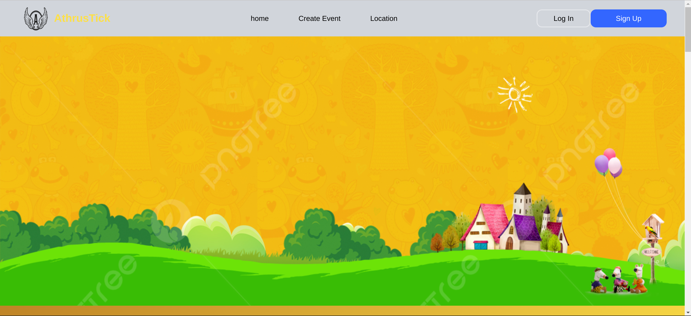
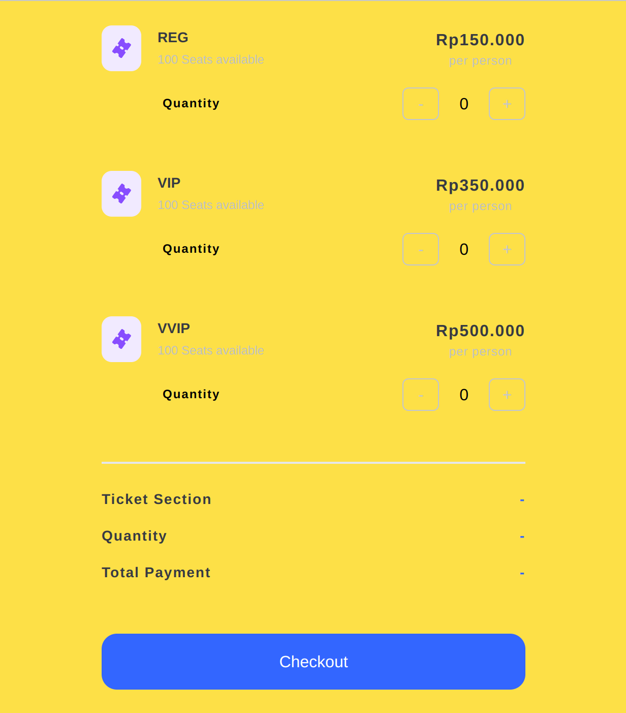

# ATHRUSTICK

AthrusTick is an event ticket booking application, where users can view events anywhere, buy tickets, add events to their wishlist and can also add events that will be held
<div style=>
  
   
     
</div>

Built using


## Table of Contents

- [Features](#features)
- [Installation](#installation)
- [Project Structure](#project-structure)
- [Technologies Used](#technologies-used)
- [Contributing](#contributing)

## Features

- Users can view event details, buy event tickets and add events to their wishlist
- ensure the application can be accessed from various devices such as tablets, desktops and cellphones
## Installation

To run the project locally, follow these simple steps:

1. Clone this repository
```sh
git clone https://github.com/ThofikhBisyron/fgh21-react-event-organizer/
```
2. Open in VSCode
```sh
code .
```
3. Install dependencies
```sh
npm install
```

## Technologies Used

- React.js: A JavaScript library for building user interfaces.
- Redux: For managing state in large-scale applications.
- Tailwind CSS: Utility-first CSS framework for styling the UI.

## Project Structure

The project structure is organized as follows:

- `src/`: Contains the source code of the project.
  - `assets/`: Stores static files like images, fonts, and stylesheets used in the project.
  - `components/`: Contains reusable UI components that are used throughout the project.
  - `pages/`: Includes individual pages or views of the application, where each page represents a different route.
  - `redux/`: Stores Redux-related files, such as actions, reducers, and store configurations for managing global state.
 
## Contributing

Contributions are welcome! Follow the steps below to start contributing:

Fork this repository.
Create a new feature branch (git checkout -b new-feature).
Commit your changes (git commit -m 'Add new feature').
Push to the branch (git push origin new-feature).
Create a pull request.
